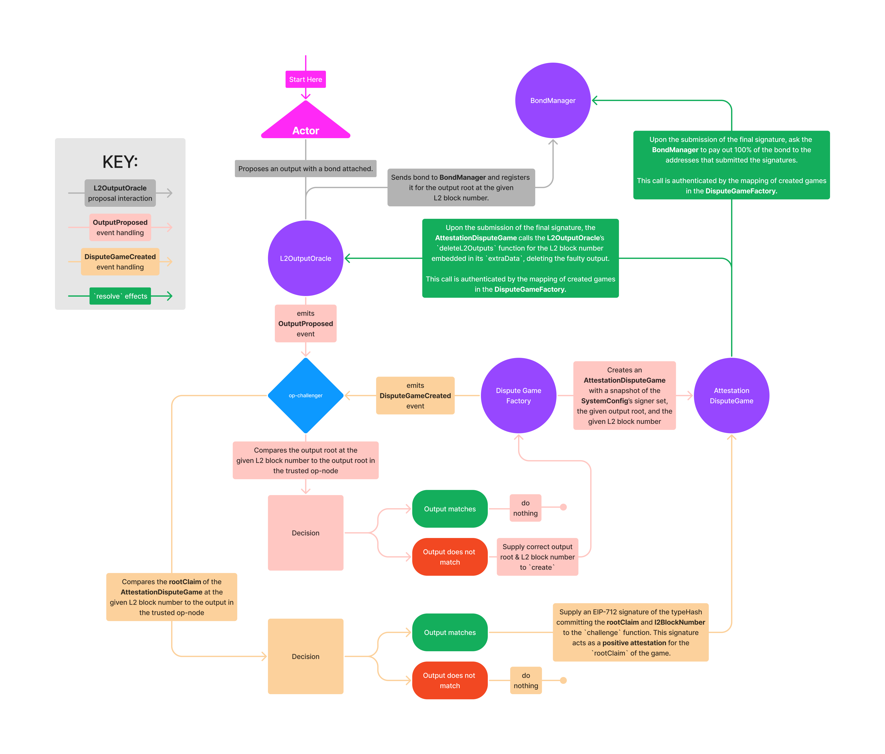

# Challenger Specification

<!-- START doctoc generated TOC please keep comment here to allow auto update -->
<!-- DON'T EDIT THIS SECTION, INSTEAD RE-RUN doctoc TO UPDATE -->
**Table of Contents**

- [Description](#description)
- [Terminology](#terminology)
- [Event and Response Lifecycle](#event-and-response-lifecycle)
  - [`GameType.FAULT`](#gametypefault)
  - [`GameType.ATTESTATION`](#gametypeattestation)
  - [`GameType.VALIDITY`](#gametypevalidity)

<!-- END doctoc generated TOC please keep comment here to allow auto update -->

## Description

The Challenger is an off-chain agent that listens for faulty claims made about the state of
the L2 on the data availability layer. It is responsible for challenging these incorrect claims
and ensuring the correctness of all finalized claims on the settlement layer.

The Challenger agent is intended to be ran as a permissionless service by participants of the network
alongside a [rollup-node](./rollup-node.md). Challenger agents will be rewarded in the form of the
bond attached to the claims they disprove.

## Terminology

- **data availability layer** - In the context of this document, the data availability layer is the
  generic term for the location where claims about the state of the layer two are made. In the context
  of Patex, this is Ethereum Mainnet.
- **settlement layer** - In the context of this document, the settlement layer is the location of the
  bridge as well as where funds deposited to the rollup reside. In the context of Patex, this is
  Ethereum Mainnet.
- **L2** - In the context of this document, the layer two of the Patex Rollup. In the context
  of Patex, this is the Patex Mainnet.
- **rollup-node** - In the context of this document, the rollup node describes the
  [rollup-node specification](./rollup-node.md). In the context of Patex, this is the implementation
  of the [rollup-node specification](./rollup-node.md), the `pt-node`.

## Event and Response Lifecycle

The Challenger agent is expected to be able to listen for and respond to several different events
on the data availability layer. These events and responses are parameterized depending on the type
of dispute game being played, and the Challenger listens to different events and responds uniquely
to each of the different game types. For specification of dispute game types, see the
[Dispute Game Interfaces specification](./dispute-game-interface.md) and
[Dispute Game specification](./dispute-game.md).

### `GameType.FAULT`

> **Warning**  
> The `FAULT` game type is not yet implemented. In the first iteration of Patex's decentralization effort,
> challengers will respond to `ATTESTATION` games only.

**Events and Responses**
*TODO*

### `GameType.ATTESTATION`

**Events and Responses**

- [`L2OutputOracle.OutputProposed`](../packages/contracts-bedrock/contracts/L1/L2OutputOracle.sol#L57-70)
  The `L2OutputOracle` contract emits this event when a new output is proposed on the data availability
  layer. Each time an output is proposed, the Challenger should check to see if the output is equal
  the output given by the `Patex_outputAtBlock` endpoint of their `rollup-node`.
  - If it is, the Challenger should do nothing to challenge this output proposal.
  - If it is not, the Challenger should respond by creating a new `DisputeGame` with the
    `DisputeGameType.ATTESTATION` `gameType`, the correct output root as the `rootClaim`, and the abi-encoded
    `l2BlockNumber` of the correct output root as the `extraData`.
  
- `DisputeGameFactory.DisputeGameCreated` A new dispute game has been created and is ready to be reviewed. The
  Challenger agent should listen for this event and check if the `rootClaim` of the `AttestationDisputeGame`
  created by the `DisputeGameFactory` is equal to the output root of their `rollup-node` at the game's `l2BlockNumber`.
  - If it is, the Challenger should sign the [EIP-712 typeHash](./dispute-game.md) of the struct containing the
    `AttestationDisputeGame`'s `rootClaim` and `l2BlockNumber`. The Challenger should then submit the abi-encoded
    signature to the `AttetationDisputeGame`'s `challenge` function.
  - If it is not, the Challenger should do nothing in support of this dispute game.
  

A full diagram and lifecycle of the Challenger's role in the `ATTESTATION` game type can be found below:

### `GameType.VALIDITY`

**TODO**

> **Warning**  
> The `VALIDITY` game type is not yet implemented. In the first iteration of Patex's decentralization effort,
> challengers will respond to `ATTESTATION` games only. A validity proof based dispute game is a possibility,
> but fault proof based dispute games will be the primary focus of the team in the near future.

**Events and Responses**
*TODO*
